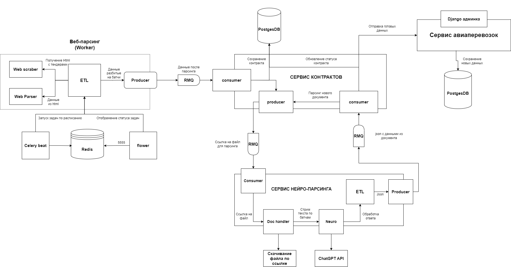
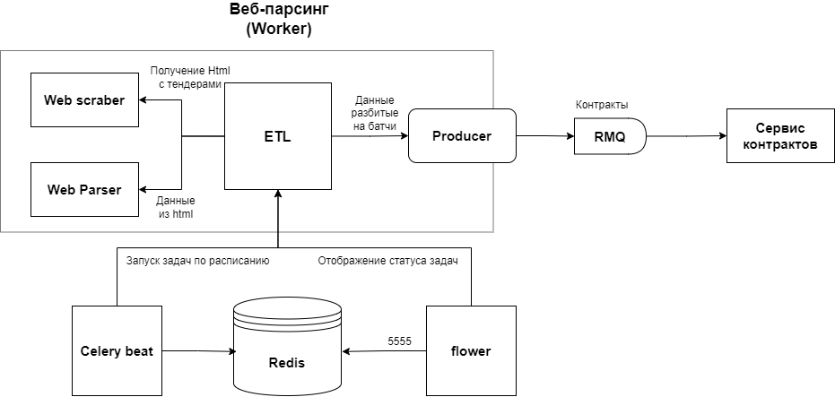
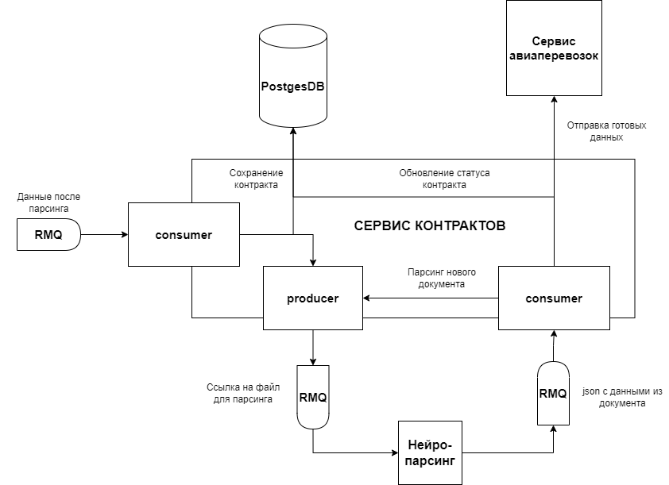
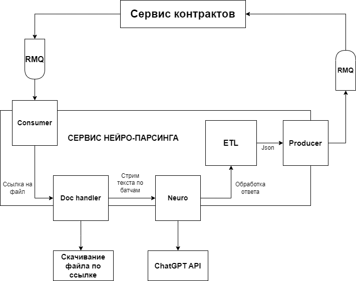
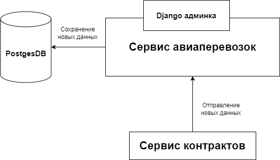

# Сервис по сбору и хранению исторических данных авиаперевозок

### Сделано совместно с [toth3m00n](https://github.com/toth3m00n). ###

Проект был сделан в закрытом репозитории университета. Перезалит сюда после завершения учебы.

xBhgbz:
- разработка архитектуры,
- сервис нейро-парсера,
- сервис контрактов (40%).

toth3m00n:
- разработка архитектуры,
- сервис веб-парсинга,
- сервис контрактов (60%),
- сервис авиаперевозок.

### Стэк ###
&nbsp;
&nbsp;
&nbsp;
&nbsp;
&nbsp;
&nbsp;
&nbsp;
&nbsp;
&nbsp;
&nbsp;
&nbsp;
&nbsp;
&nbsp;

### Локальный запуск

1. Создать в корне проекта .env (см example.env)
2. Запустить команду ```docker-compose up -d --build``` (*при изменении кода в проекте пересобирать не нужно.*)

---

# О приложении

Данное приложение выполняет цель сбора и накопления исторической информации по авиаперевозкам и их ценам. В качестве источников информации были выбраны сайты закупок/договоров/контрактов, такие как https://zakupki.gov.ru/. Приложение получает данные с сайта, обрабатывает информацию из договоров и вложений и сохраняет полученную информацию.

## Общая схема работы


Приложение разбито на 4 самостоятельных сервиса:
- сервис веб-парсинга данных;
- сервис контрактов;
- сервис нейронного парсинга файлов;
- сервис авиаперевозок.

Далее будет детальное описание каждого из сервисов

## Сервис **Веб-парсинга** (site_parsing)

### Схема сервиса Веб-парсинга


Данный сервис отвечает за получение информации по контрактам из интернета.

**Сайты, которые сейчас парсим:**
1. https://zakupki.gov.ru/ (контракты и закупки)

 Для https://zakupki.gov.ru рассматриваются следующие коды ОКПД-2
+ 52.23.19.110 — Работы авиационные
+ 52.23.19.111 — Работы авиационно-химические
+ 52.23.19.112 — Съемки воздушные
+ 52.23.19.113 — Работы лесоавиационные
+ 52.23.19.114 — Работы строительно-монтажные и погрузочно-разгрузочные
+ 52.23.19.115 — Работы с целью оказания медицинской помощи
+ 52.23.19.119 — Работы авиационные прочие
+ 51.10.1 — Услуги по пассажирским перевозкам воздушным транспортом
+ 51.10.11 — Услуги по регулярным пассажирским перевозкам воздушным транспортом на местных линиях
+ 51.10.12 — Услуги по нерегулярным пассажирским перевозкам воздушным транспортом на местных линиях, кроме услуг по осмотру достопримечательностей с воздуха
+ 51.10.13 — Услуги по регулярным пассажирским перевозкам воздушным транспортом на международных линиях
+ 51.10.14 — Услуги по нерегулярным пассажирским перевозкам воздушным транспортом на международных линиях
+ 51.10.15 — Услуги по нерегулярным перевозкам пассажиров воздушным транспортом экскурсионные


**Возможные доработки:**
+ **[оптимизация]** асинхронный обработчик url сайтов с тендерами;
+ **[улучшения]** посмотреть можно ли ходить в https://zakupki.gov.ru/ по апи **[Получение открытой информации](docs/Инструкция_по_использованию_сервисов_отдачи_информации_с_регистрацией.pdf)**

Что отдается в сервис **Контракт** (по 10 шт. на сообщение)
```
{
    "site_url": "string", # - ссылка с сайта откуда парсили
    "tender_info_link": "string", # - основная информация по тендеру
    "tender_number": "string", # - номер тендера
    "purchase_object": "string", # - объект закупки
    "customer": "string", # - заказчик
    "price": float, # - цена тендера
    "documents_info": list[dict] # - информация по документам (вложения)
}
```

На 05.01.24
+ Парсит список тендеров (по 100 на стр.) за  ```0.06455 s```
+ Парсит вложения тендера за ```0.0459 s```

## Сервис контрактов

### Схема сервиса контрактов


Данный сервис отвечает за обработку собранных из интернета данных по авиаперевозкам. Он хранит текущее состояние обработки контракта, а также руководит процессом получения информации из файлов контрактов.

Формат сообщений отправляемых в сервис нейропарсинга:
```
{
    "site_url": "string",
    "tender_number": "string",
    "documents_info": "{"link": "string", "title": "title"}"
}
```

Формат сообщений, получаемых от сервиса нейропарсинга: 
```
{
    "site_url": "string",
    "tender_number": "string",
    "parsed_data": {
        "contract_data": {
            "weather_conditions": ["string"], # дополнительные погодные условия
            "equipment_conditions": ["string"], # дополнительные требования к оборудованию
            "additional_services": ["string"] # дополнительные услуги контракта
            "date_start": "string", # дата начала контракта
            "date_finish": "string", # дата конца контракта
            "contractor": "string" # исполнитель контракта
        },
        "avia_data": [
            {
                "route": [
                    {
                        "name": "string", # название пункта
                        "longtitude": "string", # долгота
                        "attitude": "string", # широта
                    }
                ]
                "aircraft_examples": ["string"], # Подходящие по контракту авиационные средства
                "cargo": "string", # Структура груза
                "cargo_volume": number, # Объем груза кг, кол-во
                "distance": number, # Общее расстояние км
                "flight_hours": number, # Количество летных часов
                "aircraft_number": number, # кол-во ВС
                "aircraft_type": "string", # Тип ВС
                "drone_type": "string", # Тип БВС
                "drone_payload": number, # масса полезной нагрузки БВС в кг
                "drone_service_type": "string", # Вид авиационного контракта БВС
                "regularity_type": "string", # Тип регулярности авиационного контракта
                "work_type": "string", # Тип работы
                "number_flies": number
            }
        ]
    }
}
```

**Возможные доработки:**
+ **[улучшения]** сохранение готовых данных по контракту при неуспешной отправке в сервис авиаперевозок;
+ **[улучшения]** сохранение промежуточных данных, полученных из предыдущих файлов, чтобы иметь возможность получать информацию на основе нескольких файлов;
+ **[улучшение]** сохранять title документа в отдельном поле
+ **[оптимизация]** улучшение алгоритмов работы сортировки файлов, чтобы отсеивать ненужные нам файлы.
+ **[улучшения]** подвержать вручную обработку сообщение из сервиса Веб-парсинга

## Сервис нейро-парсер

### Схема сервиса нейро-парсера


Данный сервис отвечает за парсинг данных из файлов. Он получает из очереди файл, данные из которого он должен получить. Сервис скачивает этот файл, достаёт из него текст, а затем прогоняет, через нейронку, чтобы получить данные по авиаперевозкам. Полученные данные он отправляет в RabbitMQ.

**Возможные доработки:**
+ **[улучшения]** обучение своей нейросети для задачи поиска данных в контракте;
+ **[оптимизация]** реализовать возможность обрабатывать нескольно файлов ассинхронно с помощью нескольких инстансов сервиса или другой нейронки + ассинхронные запросы.

### Схема сервиса авиаперевозок


Данный сервис отвечает за хранение итоговой информации по авиаперевозкам. Этот сервис использует Django и имеет удобную админку, в которой можно просматривать данные и редактировать их при необходимости.

**Возможные доработки:**
+ **[улучшения]** добавление выгрузки в формате csv/xlsx.
+ **[улучшения]** кастомные ошибки
+ **[крит. улучшения]** парсить большие файлы (более 40k символов)

---

## Возможные оптимизация и улучшения по всем сервисам:
+ **[улучшения]** сбор логов с сервисов
---


## Project status
*In proccess...*
